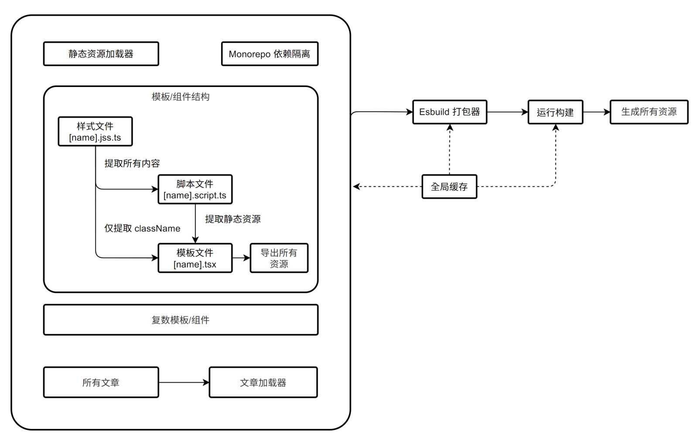

# 概述

博客里文章没几篇，但是博客架构被我前前后后折腾四五次了~~捂脸~~。
现在这个版本是目前为止觉得比较合乎我自己设想的版本，这篇文章主要是记录一下这次新架构被我折腾成啥样了，一方面也是好久没写~~懒狗~~文章了，来水一篇博文。

# 名词说明

|   名称   | 说明                                                                                 |
| :------: | :----------------------------------------------------------------------------------- |
|   模板   | 网页模板，即生成 HTML 文件的部分内容。                                               |
|   脚本   | JavaScript 脚本，在这里是指网页使用`script`标签引用的代码。                          |
|   样式   | CSS 代码，在这里是指网页使用`link`标签且包含属性`type="text/css"`引用的代码。        |
| Monorepo | 在单个代码库里包含了许多项目的代码，这些项目虽然有可能相关，但通常在逻辑上是独立的。 |

# 版本简述

## 1.0

在最早的博客架构中，采用的是最传统的结构，即——所有内容都是分开写的，依靠着各种很弱的“约定俗成”来达成不同资源的引用和共享，虽然这种形式是可以完成目的的，但是写起来非常烦人，各种“约定俗成”的规则都能单独记一个文件，每次我要改动某个配置，都要先看看这个规则文件，然后看有没有改错某个路径，非常的不方便。当时的模板采用的是 [PUG](https://pugjs.org)，样式是 [Stylus](https://stylus-lang.com/)，Markdown 解析器是个人修改的 [marked](https://github.com/xiaoboost/blog/blob/1.0/lib/marked.js)。
这个架构没多久就被我抛弃了，然后便是之后的*2.0*版本。

## 2.0

这个版本我采用了当时比较流行的 Vue 框架，借助通用的 Webpack 编译工具实现了各种静态资源的随意引用，网站也改为了*单页应用*的形式。但是编译虽然是方便了，但是最终的效果没能达成当初设定的要求，主要问题在单页应用上，它主要有两个问题——

- 产物太大了
- 首屏效果不好

这两点都很好理解，单页应用的构建流程里，它会把 Vue 等库全部打包进产物中，并且在首屏它是会先实例化 Vue，然后再去渲染，是完不成首屏直出的效果的。Markdown 解析器沿用的 1.0 版本，这个解析器的优势是小巧，但是也有个很严重的问题，就是太麻烦了。我想要加个数学公式的组件，想要加个复杂的显示效果，都必须要修改解析器的解析流程来实现，非常的麻烦。并且，虽然 Vue 是单文件组件，但是这只是把代码放在了一个文件里，他们之间并没有实现彻底的共享变量，尤其是对于我希望能在模板和样式之间共享变量时候，就非常纠结。

为了改进以上这几个问题，我又进行了次重构，这就是后来的*3.0*版本。

## 3.0

这个版本为了解决共享变量的问题，决定采用全`TypeScript`来写，模板部分更换为 [React](https://reactjs.org/)，样式则采用了 [JSS](https://cssinjs.org/)。这两者的共同优势就是，因为都是 JavaScript 语言的延申，所有可以非常方便的在之间共享变量，就和引用普通的 JS 模块那样。另外，为了保证首屏效果， React 和 JSS 并不会被打包到运行时的代码中，所有内容都会在本地编译中生成好。静态网页使用 React 的 SSR 功能输出，样式文件则使用 JSS 来输出编译好的代码。
Markdown 编译器也更换成了 [MDX](https://www.mdxjs.com)，它的优势就在于，允许在 Markdown 中引用 React 组件，于是添加新组件的时候，可以直接在`.md`文件中使用`import`语句来引用，并不需要去变更解析器的解析流程了。
这样下来，就实现了*模板*、_脚本_、_样式_、*文章*这四者之间模块和变量的共享。

对于编译流程，因为这套流程改动太大，于是干脆去掉了 Webpack，手动编写编译流程。为了方便管理，将不同的模板、组件都拆分开，使用`Monorepo`来管理这么多包。

到此为止，似乎看起来还挺好的，其实不然，这里还是有几个问题：

1. JSS 中引用了另一个样式文件（`@import`形式），若是这个样式文件里还有静态资源（比如字体），此时是无法识别的，因为这个 JSS 本质上是脚本，解析器无法递归的去解析里面的样式文件具体是什么。
2. 采用了 Monorepo 之后，每个模板/组件都被迫单独编译，调试的时候实在是痛苦，因为我需要开两个线程，一个是主构建流程，还有一个是当前正在修改/调试的组件库，实在是麻烦。
3. 在构建过程中，我们需要把所有组件的静态资源都全部打包到一起吗？比如 katex 数学公式库，这个库的样式和字体的体积特别大，如果打包到整体的样式文件中，每次打开网站都要一起加载，这实在是不怎么*优雅*。

## 当前版本

前言已经说的太多了，终于说到了现在的*4.0*版本了。没错，这个版本就是为了解决上述问题，这个版本我觉得拿来做日常使用已经没有什么大问题了，剩下还有些诸如构建不够快，错误提示不够明显之类的事情，都是不需要变更架构的小问题。实际上，改了这么多版本，其核心要点总结其实是是这么几点：

1. 变量共享
2. 自定义组件
3. 代码分割

接下来我就从模块划分的角度来说说这个博客的构成。

# 详细说明

博客架构流程如下图所示：



和普通的前端或者后端项目不同，打包代码之后需要立刻运行打包好的代码，这是因为打包好的代码只是“生成网站的程序”，所以还需要运行这个打包好的代码来生成网站。

## esbuild 插件系统

在进行详细介绍之前，必须要先介绍一下这次的核心——esbuild，因为所有操作都是围绕着它来实现的。下面的所有加载器，实际上都是作为 esbuild 的插件存在，这里主要使用了 esbuild 的插件系统的这么几个通用 API——

### 基本形式

esbuild 的插件是个包含`name`和`setup`函数的对象，一个最为简单的插件大约是这样的：

```ts?platform=node
import { build, Plugin } from 'esbuild';

const envPlugin: Plugin = {
  name: 'env',
  setup(build) {
    build.onResolve({ filter: /^env$/ }, (args) => ({
      path: args.path,
      namespace: 'env-ns',
    }));

    build.onLoad({ filter: /.*/, namespace: 'env-ns' }, () => ({
      contents: JSON.stringify(process.env),
      loader: 'json',
    }));
  },
};

build({
  entryPoints: ['app.js'],
  bundle: true,
  outfile: 'out.js',
  plugins: [envPlugin],
});
```

这个插件将会拦截所有对于`env`库的引用，然后这个库将会返回现在`process.env`的内容。

### OnResolve

当你注册了`onResolve`钩子，这个回调将会拦截所有符合过滤设置的引用，你可以在回调中自定义路径解析的方式——比如变更路径，比如将其设置为外部库。下面是一些例子：

```ts
import { build, Plugin } from 'esbuild';

const envPlugin: Plugin = {
  name: 'example',
  setup(build) {
    // 重定向
    build.onResolve({ filter: /^typescript$/ }, (args) => ({
      path: `node_modules/typescript/package.json`,
    }));

    // 重定向
    build.onResolve({ filter: /^jq$/ }, (args) => ({
      path: 'jq',
      external: true,
    }));
  },
};
```

### OnLoad

当你注册了`onLoad`钩子，这个回调将会拦截所有未被标记为`external`的路径读取操作，你可以在回调中自定义文件读取的操作，下文的 JSS 加载器就是利用此钩子完全重写了`.jss.ts`文件的内容。这里是个简单的读取`.txt`文件的例子：

```ts?platform=node
import { build, Plugin } from 'esbuild';
import * as fs from 'fs/promises';

const envPlugin: Plugin = {
  name: 'txt-loader',
  setup(build) {
    build.onLoad({ filter: /\.txt$/ }, async (args) => {
      let text = await fs.readFile(args.path, 'utf8');
      return {
        contents: JSON.stringify(text.split(/\s+/)),
        loader: 'json',
      };
    });
  },
};
```

## 模板/组件加载器

整个流程中最为复杂的就是模板/组件部分，毕竟这是整个网站除开文章本身之外的核心内容了。可以看到这个部分实际上是由三个部分组成的：

1. 样式文件：`[name].jss.ts`
2. 脚本文件：`[name].script.ts`
3. 模板文件：`[name].tsx`

在代码打包过程中，样式文件和脚本文件是要打包到最终网站的产物里，而模板文件只是用来生成网页的 React 组件。所以在这里，这三者看起来都是 TS 文件，但是它们的上下文和运行环境是不同的，打包这些代码实际上会把样式文件、脚本文件转变为对应的静态资源合并到当前模板/组件的另外引用的静态资源中。

之所以这么设计，最重要的原因就是为了实现*变量共享*，这里共享的变量除开常规的普通变量，还有样式的类名。常规变量自不必说，样式的类名会被加载器提取出来，而 CSS 源码会被单独拿出，这样就避免了把 JSS 打包进网站，而且也实现了类名的共享，不必再到处复制粘贴字符串的字面量了。这里举个例子：

```ts
import jss from 'jss';

export default jss.createStyleSheet({
  show: {
    display: 'block',
  },
});
```

```ts?platform=browser
import styles from './styles.jss';

const elements = document.querySelectorAll<HTMLElement>(`.${styles.classes.show}`);

Array.from(elements).forEach((el) => el.setAttribute('data-index', 1))
```

样式文件和脚本文件会被加载器转换为普通的静态资源一并导入模板文件中，模板文件中实际上就含有生成网页的模板函数以及当前模板/组件的所有静态资源。

### JSS 加载器

所谓加载器，是指针对某种特定文件进行处理使之转换为标准输入的插件，这里的 JSS 加载器，即是指针对后缀为`.jss.ts`的文件处理的插件。在原始的代码中，都会去引用原始的 JSS 库的导出，并且还有类似`Color`的辅助库，如果不对这些东西进行处理，那么它们必然会被打包到最终的产物中。

可以参考下面的例子：

```ts
import jss from 'jss';

export default jss.createStyleSheet({
  blockShow: {
    display: 'block',
  },
});
```

上述代码最后会被转化为：

```ts
import './[name].css';

export default {
  classes: {
    blockShow: 'block-show',
  },
};
```

在最后的结果中，完全去掉了 JSS 的引用，只留下了类名常量，以及对 CSS 文件的引用，这个 CSS 文件也是加载器生成的，之后 esbuild 在构建时，从缓存中读取出来即可。如果是模板文件的引用，则还需要另外去掉第一行对于 CSS 文件的引用，因为模板文件并不关心这个，CSS 文件作为静态资源的一部分，最后会在脚本文件中被引用和转化。

这个加载器的原理实际上很简单，就是拿到 JSS 样式文件之后，将代码单独打包然后运行，拿到最后生成的 JSS 实例，最后由这个实例转换成对应的类名和最后的 CSS 文件。

### Script 加载器

这个加载器是用于后缀为`.script.ts`文件的转化，此文件将会把样式脚本和静态资源（除了模板直接引用）进行整合和导出。这个部分比较简单，使用 esbuild 将所有代码打包，然后将所有引用的静态文件还有样式文件还有它自己这个脚本文件分门别类的设置到对应的路径即可。

## 文章加载器

文章加载器，顾名思义当然是为了转换文章本身的插件。文章本身转化为 React 组件是使用 MDX 的官方库`@mdx-js/mdx`，这个问题不大，但是我个人想要更为自动化的进行处理。

### 自定义组件

在文章中使用自定义组件是这样的：

```md
import { MathBlock } from '@blog/mdx-katex';

这里是文本

<MathBlock>// 公式内容</MathBlock>

这里是文本
```

此次的设计目标中有一项，类似 Katex 这样很大但是并不常用的库都从全局静态资源中剥离出去了，那么当我手动使用了这样的库之后，就需要单独在这个页面中加入对于这个组件的静态资源引用。在这种情况下，我希望能自动识别文章中引用的自定义组件，然后自动导出其静态资源，这样在生成页面时，就并不需要我做另外的操作，直接把此文章灌入模板中就行了。

想要实现上述内容，是离不开对于文章本身 AST 分析的。AST 的生成是使用 MDX 官方推荐的`remark-mdx`来实现。

在 AST 中搜索自定义组件的内容，然后将所有自定义组件整合，再在转换后的文章代码尾部附加一段导出静态资源的函数即可，就以上文中对于`@blog/mdx-katex`组件的引用为例，这里会在文章末尾添加一段这样的代码：

```ts?lsp=false
import a1 from '@blog/mdx-katex';

export function getComponentAssetNames() {
  return [].concat(a1.getAssetNames());
}
```

这样的话，在别的地方引入了此文章，就可以直接使用此函数来获得所有引用的静态资源了。

### 静态资源

文章中除了自定义组件，还有很多图片等等纯静态资源，这些资源最后也是要进行处理，然后整合的。这里采用的方法和自定义组件是类似的，分析 AST 然后搜索到对应的原始资源，然后在最后附加导出函数这样就实现了静态资源的静态导出。不过图片这些静态资源还会修改原始引用，因为要把路径都修正了，实现起来比自定义组件要稍微麻烦一点。下面是现在的处理方式：

```md
这里是文本


```

这个对于图片的引用，最后会变成这样：

```tsx?lsp=false
import Image1 from './image1.jpg';
import Image2 from './image2.jpg';

这里是文本


export function getPostAssetNames() {
  return [].concat([Image1, Image2]);
}
```

## Monorepo 依赖隔离

在整个网站生成器的代码打包之后，我发现生成的代码实在是太大了（十几兆），非常不方便调试，仔细调试之后才发现，原来是将每个组件使用的各种本地库都打包进来了，实际上这是没必要的。因为这个打包生成的代码并不是最终代码，只是拿来运行一次就扔掉的中间产物。所以这里需要将每个子包内的“本地库”的代码全部隔离，不需要将它们代入产物中。但是仅仅将这些包都标记为`external`是不能实现的，因为只是标记为外部包的话，代码会变成`require('xxx')`，打包完成之后，最后生成的代码已经脱离了原本它所在的上下文，所以这里必须要使用`createRequire`接口来实现隔离。举个例子：

```ts
/// <reference import-type="@types/katex" />

import Katex from 'katex';

console.log(Katex.renderToString('cos(ζ)'));
```

上面的代码会被转化为：

```ts?platform=node
import { createRequire } from 'module';

// 这里的模板填入当前文件的路径
const localRequire = createRequire('${file}');
const Katex = localRequire('katex');

console.log(Katex.renderToString('cos(ζ)'));
```

在上面的例子中，使用`createRequire`接口，保留了源文件所在的路径的`require`上下文，这样才能保证能正确的引用到这个库，成功的实现了隔离。

# 还有哪里不够完善

以上就是整个大概的结构和内容了，我个人还是比较满意的，基本实现了我最初的设计目标。但是也并不意味着这个就很完美了，到现在为止，我觉得还有 2 个比较严重的问题。

## MDX 编译器不够强大

说真的，当初选择 MDX 是因为它很“自由”，允许在 Markdown 文件中写 JSX 代码，这个理念是很好的，但是 MDX 的编译器实在是太弱了……上面的很多内容看起来实现的轻松写意，实际上我魔改了很多 MDX 编译的内容。
MDX 的编译是用`acron`来实现的，对于 MD 语法的兼容非常差，有相当多“约定俗成”的内容，自由度也非常低。比如说，MDX 的语法有一项，是允许在花括号内写 JS 语言内容，比如：

```md
这里是第{'123'}行
```

我本以为这个花括号是可以放在任何地方的，结果只能放在文本行内，想要把这个放到类似``中，实现动态图片就是不行的。上文中提到的关于文章引用的静态资源就牵扯到这里，这里实际上我是用另外的手段来实现的，并未依靠 MDX 自身的编译器。

凡此种种，还有很多例外情况，MDX 这个编译器真的一言难尽，我觉得有空的话一定要重写一个，现在官方这个太难用了。

## 代码分割不够智能

代码分割不管在哪里都是很麻烦的事情，webpack 关于代码分割的恩怨纠葛能写上几千字的说明，在这里也是一样的。在我的设计目标中，模板是有表示网站最基础布局的`layout`，文章的`post`，然后组件是分为，在基础布局中的内置组件，在文章中的内置组件，还有都不在这俩里面的纯外部组件。这里就需要对代码进行分割，基础布局一份，文章一份，然后纯外部组件每个一份，以后说不定还有更多种类。
这就带来个很麻烦的问题，我现在只能通过`.script.ts`文件来写死它们之间的引用关系，这实际上比最早的“约定俗成”好不到哪里去，因为一旦我若是决定变更分割的内容，我要先把这些引用关系都列出来，看看若是改了的话会不会造成别的影响。

# 总结

在这里讲的都是些比较大概的内容，实际上还有很多细节的部分没有涉及，比如全局缓存，比如语言服务的具体实现等等，不过这些细节并不影响整个大框架的实现就是了。
这次博客架构的变更我尝试了很多新玩意儿，中途其实推到过很多次，最大的遗憾还是在代码分割方面无法很好的达成目标，最后的实现也只能说勉强吧，希望以后能考虑到更好的方法。以及架构搞完了，剩下的就是样式的细节了，这个网站的样式还有很多问题需要改的。哎，好肝啊！
