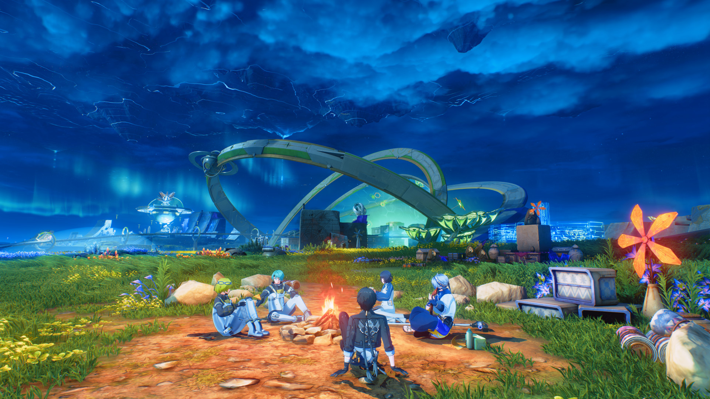
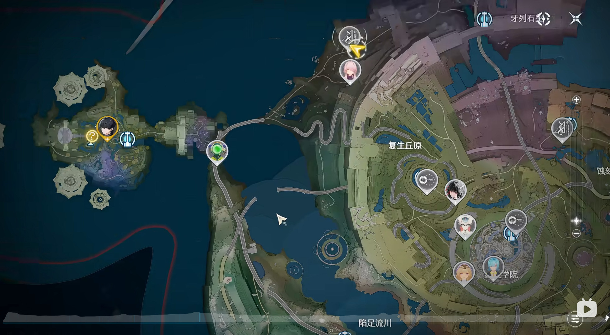
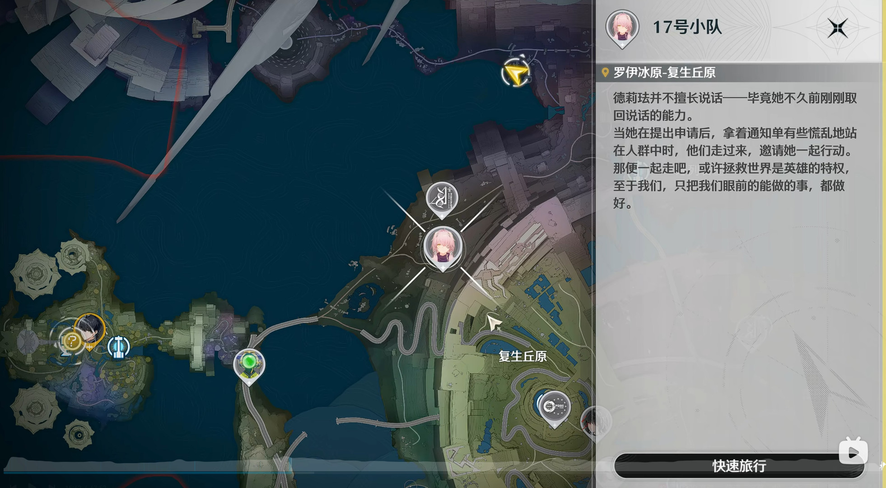
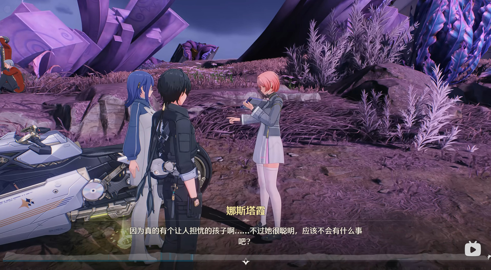

# 故事的两种讲法

## 世界神话

先抛开鸣潮所有的专有名词，只讲故事本身。这个故事的味道，在剥离了鸣潮语境之后，也应该能被感受到。

一个从星海之外远航而来的巨大机器人，在目的地的地底发现一头即将破封而出的怪物，于是耗尽自身的能量，用一把剑将它重新钉回了地下。此后漫长的岁月里，这个机器人的零件被风雪剥落，散落在大地上变成了各种各样的机械生物；它的神经信号飘散开来，化作一群又一群可爱的小生灵；而它胸腔里那颗炽热的心脏熔炉，被取出来悬在空中，成了这个地底世界的新太阳；这柄插在地上的巨剑也成为了支撑这个地底世界的支柱。
生活在这片土地上的人们，就在这颗人造太阳下繁衍生息。他们放牧机器人零件变成的兽群，饲养神经信号变成的小动物，也世世代代研究着这个沉睡的巨人，它躺在雪原里，像一座山脉。不知多少年过去，这一切都成了传说与神话。直到地底怪物再一次撼动封印，人们用自己远远称不上精密的技术，为巨人重造了一颗心脏，让它再度苏醒，把怪物又一次封印了回去。

在这个版本的故事里，几乎没有传统意义上的主角。它的主角是那个巨人，是那片土地，是在人造太阳下过日子的人们。真正推动这个故事的，是时间尺度、是文明与机械的共生、是人们和神明相互选择。它不是谁的英雄事迹，而是一个世界自己的神话。漂泊者，要到整个故事的最后一句话，才作为驾驶巨人的人匆匆登场。

## 英雄之旅

但如果你真的坐下来玩主线，把镜头拉回鸣潮的语境里，你会发现主线的骨架是另一个故事。

一位不知从何而来的漂泊者，为寻找自身频率流失的源头，来到冰原之下的拉海洛。他卷入了这片文明与灾厄之间的宿命般的战斗。在经历了惨痛的失败、失去了至亲之后，他联合众人的力量，为沉睡的守护者重新注入心脏，最终与巨人一同放逐了灾厄。
这是个极其古典的英雄之旅的骨架，主线的起承转合几乎可以严丝合缝地嵌进坎贝尔的英雄之旅的模型。这种结构的好处在于它天然会调动情绪，玩家陪主角走过低谷之后，对最后的胜利会更有共鸣。但它也意味着，单看骨架的话，主线在叙事形式上并没有给出多少惊喜。

这里的主角非常明确，就是漂泊者。世界退到背景里，成了英雄之旅的舞台。

## 故事的夹缝之间

这两个版本讲的是同一个事情，隧者、爱弥斯、拟制炉芯、阿列夫一，一样不少。区别只在侧重不同，前者把世界放在前景，后者把人物放在前景。
我要先说明下，“世界神话”这个框架其实是我作为玩家的解读，并非游戏明明白白写出来的。但我觉得它并非我的“马后炮”，游戏自己在结尾借爱弥斯的话把这层意思点破了——_这次不是英雄拯救世界，而是世界拯救英雄的故事_。
所以这两种讲法之间错开的那一部分，让我们看见了另外一些东西。世界神话里那些被主线挤到背景中去的东西，那片土地、那些生态、那些在人造太阳下过日子的普通人。

# 一副不算新的骨架

现在我们把目光从故事移开，重新审视支撑起整个拉海洛版本的底层设计。

## 科幻设定

先来看看支撑这副骨架的科幻设定，是扎实但不新的水平。它的时间尺度感、人与机械的生态共生、人与神相互选择的关系，这些元素在经典科幻中都有大量先例。这些都是好科幻故事的素材，但鸣潮更像是把几种经典元素做了一次得体的混搭，而非提出什么前所未见的东西。它的世界观里还有着明确的科幻乐观主义倾向，技术可以被用来做好事，探索值得为之牺牲，人类的意志有能力触及星海，这本身也不算新立场。

不过，“不新”不等于“不好”。在一个 42 天更新一次版本的商业抽卡手游里，科幻设定的首要功能是给叙事提供底座，而不是在每个版本都制造空洞的概念。拉海洛的设定在这个层面上是合格的，它自洽，有很好的质感，也能够给角色和事件提供有意义的行动空间。但如果把它放到科幻文学的谱系中去衡量，它比较接近成熟的商业化融合叙事，而非突破。

## 角色设计

角色原型同样经典。漂泊者、爱弥斯、莫宁、绯雪、西格莉卡、达妮娅、琳奈，这些角色的内核，救世主、他的追随者、被造物、迷茫的继承者、背负过去的引路人，每一个都能在其他作品中找到对应物，都是叙事传统中反复出现的面孔。
但角色设计的优劣从来不只取决于原型是否新颖。角色能否立住，主要看执行层面，人物之间如何构成关系，各自的故事弧能否自圆其说。拉海洛在这一点上有个值得单聊的巧思，我放到后面展开。这里只确认一件事，就原型本身而言，拉海洛没有发明新的人物类型，它做的是用已有的类型去组合、去对照。

## 叙事设计

叙事框架则是非常通用的分层模型，几乎所有同类作品都在使用。顶层是主线剧情，角色叙事被整合其中，每个限定角色都在主线中承担明确的叙事功能。第二层是脱离商业展示压力的支线，以独立单元剧的形式存在，节奏更从容，适合处理主线没有篇幅展开的附属主题。第三层是地图环境中的 NPC 对话，学院里、营地里、冰原上跑图时听到的只言片语，不推动任何故事，功能是提供世界的日常细节。第四层是系统叙事与碎片化文本，物品描述、科研日志、终端邮件，信息密度最高，但完全不具备强制性，只面向愿意深挖的玩家。

这套金字塔结构本身谈不上新鲜，单看拉海洛每一层的话，主线是英雄之旅的骨架，支线是称职的单元剧，NPC 对话是有质感的日常碎片，文本词条是有信息量的世界观补完。每一层单拎出来，都只能说扎实、得体。

---

实际上我想要写这篇文章的原因主要还是在 3.3 下半，我被达妮娅的故事给感动坏了，真的很想要抒发一下自己的感情。我不断地回顾整个故事，我甚至又再去看实况，又去看各个主播的直播……我的情绪在这些不断地复读中逐渐降温，理智重新占领了头脑，我产生了疑惑，拉海洛的故事真的很牛逼吗？我想了下，好像也没有那么牛逼，我的思考过程就是前面我讲述过的这些内容。
那么问题就产生了：一个各方面都谈不上最好的故事，是怎么让我感受到如此的触动？
有很多人总结说，“因为鸣潮把故事讲好了”，但是这个说法太笼统了。接下来，我想要尝试具体聊聊它到底做了什么。

# 既视感与新鲜感

## 人物群像：同一主题的不同变奏

前面说过，拉海洛的角色原型每个都能找到出处。但原型是否新颖从来不是角色设计的核心问题，真正决定一组群像人物能否立住的，是他们之间如何构成关系，以及这些关系是否指向同一个方向。拉海洛在这里的设计是很出色的，因为如果你细心观察就会发现，拉海洛的所有主要角色的主要内核其实都是围绕着同一个命题进行的变体展开。

这个命题的中心，就是我们主角漂泊者所占据的，那个当之无愧的救世主位置。
漂泊者是失忆的“神”在人间行走，他并非古典英雄作品里那种“心怀天下、断绝尘缘的纯粹圣人”；也不是当下网文中流行的“随性而为的无敌之人”。他的神性不在于力量的强大（当然他确实也很强），而在于共情的广度。老子有两句话很适合形容漂泊者：“知其雄，守其雌，为天下溪”，“受国之垢，是谓社稷主”，最低处的江海才能容纳百川，只有承受世界的苦难才能成为真正的王。漂泊者选择走过被悲鸣席卷的土地，主动接纳这些“不祥”与“哭嚎”，这正是他回应世界的方式。
而站在漂泊者对面的，是爱弥斯，她是承载记忆的“人”在模仿神明。漂泊者选择向下走入苦难，爱弥斯则选择向上——以一个普通人的身份，主动扛起了本该属于神明的责任与孤独。她憧憬他、追随他、模仿他，却偏偏在这个模仿的过程中成为了真正的自己。在时间的闭环里，她既是故事的起因（因为她的等待，拉海洛才得以存在），也是故事的答案（因为她的愿望，漂泊者才得以完整）。更准确地说，他们是互为镜像的亲子关系，漂泊者是爱弥斯的“光”，爱弥斯是漂泊者的“根”。他们互为对方的拯救者，也互为对方被留下的那个人。

确定了这个主轴之后，你就能发现拉海洛的其他角色，几乎都是这套关系的不同变体。
莫宁是漂泊者的追随者，一个因为先天疾病困在轮椅上的女孩，被漂泊者改变了一生，从此追逐星空，最终亲手为文明造出了一颗新太阳。她在某种意义上是最像爱弥斯的人，但她走的不是模仿神明的路，而是追随前辈的脚步。
绯雪则是另一个方向上的变体，她是“拯救世界失败的漂泊者”。苇原的灼樱巫女，独自对抗鸣式无数次，失败了一次又一次，直到在漂泊者身上看到了另一种可能。她对他最初的情绪是羡慕，甚至嫉妒，凭什么同样去救，他就救得下，自己只能收获遗憾。她是这个命题的另一面，如果救世主注定失败，我们又该怎么走下去？
西格莉卡是“没那么天才的爱弥斯”。被架在未来的秘日六席这个被期待的位置上，同样要面对天赋二字的重压。区别在于爱弥斯（至少表面上）游刃有余，西格莉卡却要拼尽全力，还时时害怕辜负所有人。爱弥斯身上那份举重若轻，在她身上却是普通人要竭尽全力才够得着的距离。
而达妮娅是是所有角色里最特别的一个。她不对应某一个人，她对应的是整个拉海洛的世界观本身。虚无、被造物、存在的意义、“决定你是什么的不是来处而是心”，这个篇章想讲的一切，最后都高度浓缩在她一个人身上。她是主题本身走了下来，变成一个具体的女孩。她最终用自己的生命给出了回答，而这个回答没有观众。如果说爱弥斯的牺牲有因果相衔、有整个世界的存在作为回响，那么达妮娅的反抗是完全不被看见的。她一个人独自唱完了属于自己的生日歌然后跳着小碎步走进了黑暗，这让她成了所有变体里分量最轻、却也最纯粹的那一个。
琳奈是身份认同这条线上相对薄弱的人物，她用假身份偷来了一段校园时光，最后选择用真名重新开始。她没有爱弥斯那样的重负，也没有达妮娅那样的决绝，但她的故事是同一主题的日常生活版。
陆赫斯和洛瑟菈则处在另一组对照里，一个是随身带糖果的校医，用甜提醒自己在失去前相逢是好事；一个是擅长记忆调谐却背负着学生死去的校长，从“羊群尾部的平庸之人”走到了“带领羊群赴死的引路人”。他们身上都带着过去留下的痕迹，但这痕迹没有把他们压垮，反而被转化成了某种被自己消化过的、不外溢的韧性。

把以上这些合在一起，你会发现拉海洛的人物群并不是各自独立的人物设计，而是彼此相互关联对照的。同一个主题，来处与选择、被定义与自我定义、在虚无面前我之所以是我的理由，在每个人的身上以不同的频率演奏，而这些声音之间的呼应，反过来加深了每一个单独的人物。这种写法并不追求塑造最复杂的角色，而是把一组角色写成和弦，是很有巧思和出色的设计。

不过，角色设计是一回事，展现角色的方式是另一回事。角色如何被呈现给玩家，文本的密度、演出的分寸、镜头的选择，这些才是角色能不能打动人的地方。

## 演出与文本：克制化的表达

### 整体的克制倾向

整个拉海洛版本并不缺乏高光场景。3.1 上半的爱弥斯，3.3 上半的全民动员，乃至于最后的决战，都把情绪推到了极高的地步。但整个版本做得最好的地方，我觉得是克制。这种克制不是某一个环节的选择，而是贯穿美术、演出、文本、剧情结构的整体倾向。

鸣潮在美术上采用偏冷克制的调色，光影强调体积而非通透，角色比例趋向写实，场景设计重视材质感而非插画感。这里用原神来做对比，原神的角色身材比例要更二次元、色彩高饱和明快、场景强调色彩的插画感。

演出上也是类似的，鸣潮极少使用夸张的表情和动作，角色的喜怒哀乐主要通过细微的表情变化和肢体语言传递，而非戏剧化的肢体放大。这里可以对比一下迪士尼的演出风格，夸张的肢体动作、夸张的口型、镜头的大幅运动来放大情绪。鸣潮往往是让角色站在原地，用眼神和呼吸的细微变化来承载张力。两种方式没有高下之分，但鸣潮的克制路线对演出精度要求更高，因为没有夸张动作来遮掩细节的不足，角色的微表情必须足够精准。

还有台词设计的克制，这在后面会专门展开，这里我们先按下不表。简而言之，鸣潮的台词不说满、不说透，让演出细节来补完那些“说不出来的话”。感情被压在水面之下，通过演出的画面细节来展现，而非直接说出来。
整体来看，鸣潮的这种风格其实更偏向电视剧/电影，而非夸张化的动漫式表达。

这种风格并非拉海洛才出现的，在 2.7 版本的下半就已经显露了。那段故事的主角不是漂泊者，而是两个配角，一个即将死去的地区主教，和一个从东方来追捕逃犯的剑客。两个人在对话中没有任何癫狂、悲伤的宣泄，只是很平静地交换了各自的立场和选择。

> 主教：像我一样……你应该在当时就杀了他。
> 剑客：历史没有如果，人死也不能复生。我如今失去了一切，却也仍旧还不清那些死在战场上的人们的债。我能做的，不过是再见到他时，毫不犹豫的杀了他。
> 剑客：如果让你再选一次，你还会当主座吗？
> 主教：会的。即便世人皆知我得位不正，也必将知道我宵衣旰食。
> 剑客：史笔如铁，自有后人评断。

这种写法是非常典型的武侠剧，在当时给我的印象非常深刻，在一个不以武侠为底色的二游里，采用这种叙事方式让我非常惊讶，我也是从这里开始注意到鸣潮的叙事风格。

这种风格在 3.1 下半的版本中达到了很成熟的水平，3.1 下半是主角最为脆弱的时刻。漂泊者刚刚经历了惨痛的失败，失去了至亲，又让幕后黑手逃脱。他和陆医生走在雪地里。如果这是一段传统二次元游戏的剧情，接下来通常会发生两件事：要么主角情绪爆发，要么同伴给出一段热血的鼓励。这段对话两件都没做。

> 陆医生：在想什么？
> 漂泊者：很多事。
> 陆医生：想聊吗？
> 漂泊者：……聊几句吧。

开场四句话，没有一句包含情绪词。漂泊者没有说“我很难过”，陆医生没有说“我理解你的痛苦”。漂泊者说出了自己的困惑，过去消去记忆的决定导致了他对很多事失去掌控，他把身边的人拉入拯救的计划中，自己却缺席了，这个决定真的是正确的吗？这段话的信息量很大，但语气极其平静，他只是在陈述事实和判断，不是在倾诉。而陆医生的回应同样没有去安慰他，他直接说出了更残酷的事实：就算没有这种意外，漂泊者的寿命也远超身边所有人，死亡和离别是他永远绕不开的课题。然后他再说——

> 我们也不单单是为了你，更是为了索拉里斯，为了你和我们共同守望的理想。这是我们自己选的路，你不必为之负疚。

这种“不把自己的人生归因于你”的态度，在二次元游戏里还比较少见，因为这个品类的情感逻辑通常是反过来的，所有角色的命运都应该和主角绑定，角色因主角而改变、因主角而获得意义。

然后是糖的段落。陆医生讲了自己从小到大吃糖的经历，小时候无力解决问题用甜味麻痹自己，后来继承医药集团时面对糟心官司继续吃，再后来看到帮自己的人死在面前依旧无能为力。他从头到尾都只是单纯的陈述，他说“用处不大”然后“变成了一种习惯”。最后的落点是——

> 品尝甘甜，是为了不麻木。

如果把这段话翻译成传统 ACG 的叙事语言，大概会变成：“人生虽然痛苦，但我们不能放弃希望。”，但陆医生说的是：

> 陆医生：糖没什么用，但我还是要吃，因为如果连甜味都不品尝了，我就会变成一个只在意结果的人，忘记曾经得到过的东西。
> 漂泊者：你的糖，也给我一颗吧。

然后漂泊者吃下了糖，再问了一个和糖毫无关系的问题：

> 陆，救回爱弥斯的几率……是不是很小？

这个转折是整段对话里最妙的地方，前面的铺垫就是为了让漂泊者接受现实，而现在他也确实接受了。失去是无法避免的，但不能因此麻木。然后漂泊者才放下了，问出了真正压在心里的问题。而陆医生的回答也没有给出答案，他只说：“的确，像是奇迹发生的概率那么小……但你总能创造奇迹。”这句话如果出现在其他语境里会显得很俗套，但在这段极度克制的对话之后，它的分量却刚刚好，这也是这个段落里唯一一句诉诸情感的话。

最后两人交换了一句“谢谢你的糖”、“不客气”，镜头拉远，朝阳从山下升起，两人走出画面。

---

仔细品味一下，整个剧情段落，它的质感非常像国产电视剧，如果真的是国产电视剧，这里应该是两个中年男人蹲在墙角，然后其中一个递过去一根，另一个接了，两人再默默地点上，然后一边吞云吐雾，一边说着家里的烦心事儿，最后两人看着远处的天亮起来，然后站起来拍拍屁股走了。鸣潮把这种质感放进了一个二次元手游里，体验上非常有意思。

### 文本的减法

有人说鸣潮的台词写的不好，太直白了，文笔不好。但是我要说，这大概是刻意设计的，因为台词和演出是一个整体。在演出的加持下，鸣潮并不需要花团锦簇的文本，只需要把事情说清楚就可以了。上面我列举了 3.1 下半的部分文本，你应该也能大致理解。鸣潮的语言风格我个人觉得有这么几点。

陈述句为主，极少使用修辞。鸣潮的角色台词极少使用比喻、排比、反问等修辞手法。人物说话的方式是直白的“把事情说清楚”，而不是“把事情说漂亮”，这样下来就会体现为，鸣潮的台词非常的干，没有铺垫情绪的形容词，没有升华意义的比喻。角色说的是他要做什么、他怎么看这件事。句子的功能是传递信息和立场，不是制造文学美感。
然后就是潜台词，鸣潮的台词经常少说一层。角色不说出自己的感受，只说出自己的判断或行为，感受由演出来补完。
还有就是对话节奏偏短，单句信息密度高，大部分角色的单次发言不超过三句话。每句话都在推进对话，要么给出新信息，要么表明立场，要么做出决定，很少有纯情绪发言。

作为对照，可以看看另一种叙事思路：文本自足型。这条路线的代表是《原神》的《森林书》。不考虑任务过程，只看文本，它是我在原神里体验过的顶尖水平的任务，在文本方面比主线要写的好很多。整个故事模仿《彼得潘》的框架，关于成长、关于遗忘、关于告别。文字非常优美：

> 来呀，来呀，花园的梦，森林的记忆
> 来呀，来呀，不返的风，不逆流的水
> 来呀，来呀，甜美的梦与苦涩的回味
>
> 我相信你。就像云朵会明白要降下雨滴，雨水会明白要落入土地。遇到你们，我就明白了…终于到这个时间了。我很高兴。
> 不再梦想、见不到我们的人；接受命运，不再前进的人；沉醉于恐惧与痛苦的人；他们内心已经变得坚硬，无法获得花的帮助。
> 终有一天，我的梦与你的梦、我的记忆与你的记忆，我们将会交错在一起，在沙恒的无数枝权上开花，这又何尝不是一件好事。
> 
> 我梦见，我把你给忘了。我以为兰那罗的故事，都是优丹他们小孩子的童话。我梦见，森林不过是很多树的土地，并没有魔法……
> 
> 所有的梦都会醒。
> 所有的孩子都会长大。

整个故事的氛围和文笔都是非常棒的，但是问题就在于此了，它的文本太漂亮了，漂亮到它适合拿来读，而不是拿来演，这样的文字很适合妈妈给孩子们讲睡前故事，再配上水彩的插画画册慢慢翻阅。原神的演出能力（至少在那个版本）不足以支撑这里描述的高难度场景。所以文案不得不用文字来弥补，用描写、用对话、用叙述来制造文本层面的张力。这反过来造就出了一种文本自足的写作风格，文字本身就要好看、就要有力量，因为它不能指望演出来帮忙。当角色站在那里念出“诸星的轨迹、水文的图形，在白银面前如同摊开的森林书”的时候，画面需要同时展现一个与这段文字等量齐观的视觉场景。
文本自足型叙事的上限可以很高，文字本身构成独立的审美对象，读剧本本身就是享受。但它的弱点同样致命，在需要演出的时刻，如果演出跟不上，文本层面的高期待反而会放大演出层面的落差。

回到鸣潮，对比之后鸣潮的“减法”就好理解了。鸣潮的演出能力强，文本就可以做减法，不在文字层面把话说满，留出空间让演出来填充最终的体验。在纯文本环境下读鸣潮的剧本，会觉得“还不错，但没什么文采”。但在游戏里，配合着表情、动作、镜头、音乐来体验时，有缺失的部分会被演出补上，体验就完整了，这就是所谓的刚刚好。文本的密度刚好足够让你理解发生了什么，但刚好不够多到抢走演出的空间。

肯定有人会说，鸣潮这文本这么做减法，到底是因为能力如此，还是主动的选择？我觉得这是选择，因为当它需要的时候，它也能写出漂亮的文字。深空测界台重建完成后的一段描写就挺不错：

> 我期盼的美好时光终于再次到来。
> 深空测界台缓缓转动，它投下的影子掠过悬台，展开的光纹板被炉芯照得闪闪发光，映写轮将远方传来的频率转写、记录。
> 那是关于台地起伏、林叶泛光、隧群踏行，关于这片拉海洛大地的……
> 每当它的数据如金色流光在全息屏中闪烁，我的心也为之雀跃，想着“太好了，又抢在虚质磁暴前记录下更多信息。”

### 在演出中的叙事

一说起演出，大部分玩家想到的肯定是高规格的战斗，华丽的特效，大开大合的感情宣泄。拉海洛部分的这类高规格演出实在是太多了，你随便去 B 站搜一搜实况，到处都是的。这些演出当然重要，但它的说服力是直觉性的，动作华丽、特效震撼、节奏紧凑，观众跟着肾上腺素走就行了，不需要分析也能感受到“这太爽了”。而纯对话的文戏恰恰相反，没有视觉奇观来兜底，角色就站在那里说话，镜头能做的只有构图和剪辑，演出的全部压力落在微表情、肢体动作和镜头节奏上。如果这些地方也能让玩家能看进去而不是想跳过，那才是真正见功夫的地方。

在 3.1 中段，爱弥斯向漂泊者坦白真相的那场戏的其中一个场景，如果只看文本，这段对话的信息量并不大，她说出了辛吉勒姆的真实身份和自己真正的打算，漂泊者并没有责备她。文本层面，这就是一次“坦白与接纳”的标准流程。但演出做到了文本很难表达的事情，它表演出了孩子面对家长的那种微妙的恐惧感：[爱弥斯实机片段](https://www.bilibili.com/video/BV1o7FwzUEdH/?p=4&t=2092)。

爱弥斯说“都说让你别管了”，然后身体有一个很小的后缩动作，然后抬起手，低下头，不敢看漂泊者，然后漂泊者向她走来，随着脚步声响起，一点点靠近，她不安的稍稍睁开眼睛，但是眼珠子还是不敢直视，往两边撇了几眼之后，彻底把头别了过去，她不安的等待着。我当时还没反应过来她在等什么，直到漂泊者伸出手，握住了她的手，她轻轻惊呼一声，身子往后一缩，然后才反应过来，她的表情从紧绷到困惑再到释然，最后慢慢抬起头。我这时候才想明白，这是很经典的孩子面对家长那样非常微妙的怕被打，最后惊讶没被家长打的那种感觉。

整个镜头没有台词辅助，也就几秒钟的时长，但是表演却如此丰富，它传递的信息比文本丰富多了。爱弥斯做好了被拒绝的准备，甚至做好了被厌恶的准备。而漂泊者的回应不是语言上的“我不怪你”，而是一个动作，握住了她的手，表达了对她的理解和接受。如果把这段的演出替换成角色站在原地、正反打对话、表情不变，然后让漂泊者说一句“我不怪你”，信息量是一样的，但情感冲击会损失殆尽。这就是“演出中的叙事”的具体含义，文本只给了骨架，演出把骨架上那些文字无法承载的东西全部补上了。

3.3 下半达妮娅和漂泊者坐在长椅上的那场对话，则是另一种演出难度。达妮娅本身是个相对安静的角色，动作幅度很小，又是坐姿对话，演出能用的肢体语言极为有限，大部分表达压力都落在了镜头上：[达妮娅实机片段](https://www.bilibili.com/video/BV1YZLs6eEUY?p=3&t=824)。

这段剧情合计 8 分钟，语速在鸣潮里都算得上是慢的，光看文本的话，信息量可谓少得可怜了。这段对话的核心就只做了一件事情，达妮娅承认了自己在说谎，然后坦言了自己的身份焦虑，漂泊者给出回应，仅此而已。但这一段对我来说完全没有冗余想要跳过的感觉。台词精炼是一方面，更重要的是画面演出在文本之外做了大量的事情。

先说镜头。这段对话频繁在中景和近景之间切换，中景时长椅、背景、两人的相对位置都在画面里，是旁观者的距离；近景时是脸部特写，让玩家看清每一个微表情。但最有意思的不是镜头里的内容，而是视角的归属。达妮娅说起自己想要有个生日的时候，镜头切到了路边——玩闹的一家人，谈恋爱的学生，走过的路人。这些画面是从达妮娅的视角看过去的。她在看那些拥有生日、拥有家人、拥有理所当然的日常的人。然后镜头拉到远景，路人走远，道路上又只剩漂泊者和达妮娅。由远及近，她还痴痴地看着刚才走过去的人。她的身份焦虑在此刻，被她的目光说很清晰的表达了出来。
随后是一个转场，达妮娅放下手中的书，一片落叶飘下，镜头的景深从达妮娅的脸，对准落叶，跟着它一路向下，落入湖水。镜头再上移时，整个环境已经从黄昏切换到了布满星空的夜晚。时间跳跃到晚上，而夜晚是私密的环境，标志着这场谈话会进入更深一层，达妮娅开始袒露自己的真心。
再说表演。达妮娅的这段剧情，细节密度很高，眼球的闪躲，把双腿收到椅子上双手抱膝，眼角逐渐流下的泪。打光也在配合，她情绪激动转过头的时候，发饰被路灯照出一点反光，体现她的激动，又不至于破坏整体的氛围。
最后是节奏。这段话语速特别慢，角色说话时频繁停顿。这些停顿是她在犹豫要不要继续说下去，在组织自己都还没想清楚的话，沉默本身也是表演的一部分。

如果把这段的台词全部抽掉，只看画面，你依然能读出达妮娅在经历什么，一个不确定自己是否有资格拥有日常的人，在注视着别人的日常。这就是演出在替文本完成叙事。

---

需要说明的是，上面举的两个例子并非拉海洛的特例。整个大版本主线至少七成以上的时长是这种水准的实机演出，纯对话段落同样保持着密集的镜头调度和微表情设计。

在技术执行层面，鸣潮还做了很多更激进的尝试，多处一镜到底的长镜头段落，实机演出、预渲染CG、玩家可操作 Gameplay 三者之间的无缝切换。这些手法的目标是同一个，消除看和玩之间的断裂感，让玩家始终留在角色的视角里，提升玩家的沉浸感。这种对代入感的执着，和前面讨论的克制化表达是同一套逻辑的不同面向，克制是为了让玩家主动感受，无缝是为了让玩家没有机会退出感受。

说实话，在当前主流二游普遍倾向大开大合式情感宣泄的环境里，鸣潮的克制路线其实是有点反主流的。我并不是说这唯一一种可行的叙事路径，只是想说，鸣潮在这种追求情绪密度的品类里选择退半步、不说话，用镜头去表达，这本身就是一种很需要自信的表现。

---

到这里为止，我讨论的都是主线故事，主线角色。但拉海洛给我的触动不只来自某几个主要角色和主线的高光时刻，还在那些高光之间，那些边边角角的地方。路过营地时听到的抱怨，支线里一个只出场一次的NPC讲完自己的故事就再也不会出现，地图角落里一段没有任何任务指引的对话。这些东西不属于任何一场演出，也不服务于任何一条主线，但它们加在一起，构成了一种感觉。这个世界是活的，这些人在过自己的日子，他们的喜怒哀乐不是为了等我路过才存在的。这种感觉不是任何单场演出能制造的，它来自一个完全不同的层面——这个世界本身是如何被讲述的。

## 世界的故事：英雄之外还有什么

前面我讲拉海洛的四层叙事框架：主线、支线、NPC对话、碎片文本。框架本身是行业惯例，主要还是在执行层面产生了不同。而在填充层面，有两种常见的失败模式。

一种是填充物的空洞。框架虽然完整，但第二到第四层被做成了无意义的填充物。支线是换皮跑腿通马桶，NPC 对话是毫无信息量的背景杂音，文本词条是随便糊弄的说明文字。主线打完，玩家感受到的只是主线之外的空洞。这种情况在大量工业化 RPG 里一抓一把，四层结构在纸面上成立，在实际体验中徒有其表。

第二种是主题的割裂，每一层单独拿出来可能都不算差，但它们之间没有形成呼应。比如说当前的主线在讲“解决星核危机、对抗丰饶民”，而一个占据大量篇幅的支线，却在反复追忆数百年前“云上五骁”的恩怨情仇，一段与主角当下使命几乎无关的往事。NPC 随口谈论着天气和日常，而散落在各处的书籍文本，则在不厌其烦地讲述着另一个时代的上古战争。更甚的是，主线剧情本身也被切成数段，中间还强行插入一条药王秘传的卧底线，叙事视角在各方势力间来回跳跃。玩家在不同的层之间穿行，感受到的不是层层递进，而是一种这游戏的不同部分像是不同小组分头写的的断裂感。框架有了，却没有形成合力，信息像碎片一样散落一地，既不成体系，也指不到一个共同的方向。

拉海洛在我看来基本上避开了这两种问题。但它的做法不是让每一条文本都直接服务于某个主题，那是不可能的，任何作品都有纯日常的桥段。它的做法是让支线、NPC对话和碎片文本各自承担不同的叙事功能，但最终指向同一个底色。具体来说，鸣潮在三个层面做了努力。

### 支线是主线的延伸

鸣潮自 2.4 版本起取消了独立的伴星任务，角色叙事被完全整合进主线。这意味着角色在主线中的行为空间被压得很紧，很难拥有不受主线约束的私人时刻。但拉海洛并没有因此放弃这部分叙事，而是把它转移到了支线层。3.3 版本中的很多支线都在主线之外为角色补上了她们日常的面貌。这些支线不推动主线进程，但它们让角色在主线的功能性之外增加了生活感。这些角色不只是主线里那个承担叙事功能的人，确实有着自己的生活。

这里有个很危险的概念，“角色有自己的生活”，这个概念在现在的玩家群体中几乎是个贬义词。因为它通常意味着角色在你看不见的地方和别人互动，你被排除在外；或者角色在支线里展现出一个和主线矛盾的形象，让你怀疑主线里的感情是假的；又或者支线把角色最好的情感互动分给了别的 NPC，稀释了你在主线里获得的东西。

鸣潮是怎么做的，以《破碎黯原之心》支线为例，莫宁的登场是为了解决主线的叙事框架下本就需要发生、只是没空间展开的事。魏尔伦留下的烂摊子，他的学生怎么走出来、他的同事怎么面对当年的责任，这本身就是主线议题的延伸。
《完美飞行日》更是直接，西格莉卡发现了好看的风景，想分享的人是你。她展现的性格，那种对自然的热爱、冒险精神、那种在高处看风景时的感性，和主线中她的形象完全一致，但放在一个更轻松、更私人的场景下。它没有去证明西格莉卡有自己的生活，而是给玩家一段和她独处的时间。这在情感上反而是做了加法。

但并非所有支线都需要漂泊者在场。有些内容发生在主线之前，漂泊者从未参与其中，关键在于它以什么方式出现在玩家面前。
比如达妮娅有个小彩蛋，是日灵夏耶回忆里的一段画面。达妮娅给日灵起名字，说会常来看它们，劝它们不要去归树。这段内容发生在主线之前，漂泊者不在场，是很典型的“角色不在主角身边时的生活”。
但它叙事上很安全的原因也很简单，第一，这段内容和主线人设完全一致。达妮娅在主线里就是个善良的孩子，不愿意看它们去牺牲是她性格的体现。第二，它是以回忆的形式出现在玩家面前的，并且是日灵的回忆、玩家在探索中发现。它不是任务系统强行播给你看的、和我们当下无关的别人的私生活。漂泊者在探索中遇到它，它是环境叙事的一部分，而不是叙事任务的强制性段落。
这中间有一条很微妙的界限，玩家发现角色的过去，和作者把角色的生活塞给你看，是两种完全不同的感觉。前者是“我自己发现的”，后者是“你按着我的头看的”，鸣潮的做法大幅偏向于前者。

### 日常作为世界的质地

支线层解决的是角色在主线和日常之间的连续性。但角色之外，拉海洛还有大量没有任务结构的环境叙事，那些散落在地图各处的NPC对话和日常碎片。它们不推动任何剧情，但它们构成了世界的质地。

这不是鸣潮从一开始就做到的事。黎那汐塔版本的大部分NPC只是会走路的建模，七丘版本有了基础对话和几个长支线，到拉海洛才迎来彻底的质变。拉海洛版本填充的巨量的生态对话以及文件文本，是黎那汐塔好几倍。B 站有人做了个[拉海洛神人对话](https://www.bilibili.com/video/BV1Y1BkBKEiz)的收集视频，这个系列居然做了整整 24 集。动捕技术的应用也让部分 NPC 有了活人感的演出，支线《星星闪烁的夜晚》里学生拍照时的表情动作、学院祭吉他手正确的指法、调酒师那夸张到让我在旁边完整看完的调酒动作。

不过，我想要说的并不是**文本很多**，而在于文本被分散到了正确的位置上，在学院的长椅上、在野外的篝火边、在科考站的空地上、在学院祭的摊位上……它们散落在整个地图上，我是在不同时间、不同地点、不同状态撞上了它们。
我尤其记得有一次，我在野外闲逛，开地图，做各种任务的时候，偶然间看到几个学生围在一起野炊，有个学生在烤三明治，另一个在弹吉他，还有两个在看夜空。我走了过去，坐在了篝火旁边，和他们一起度过这个夜晚。

类似的场景太多太多了，这种分散创造了两种体验，密集但不拥挤，文本再多，也不会堆积在一个任务里让人想跳过；偶遇而非任务，我听到的东西不是被任务要求去听的，而是我自己闲逛时发现的。这个**发现**的过程本身，就构成了世界是活着的感受。
这些内容单拎出来任何一条都毫无分量，一句“食堂真难吃”也没有任何价值。但当你在几十个角落反复撞见这种具体而琐碎的日常时，我接收到的就不再是作者在给我讲空泛的设定，而是拉海洛的人们的日常。这些日常本身不承载宏大的叙事功能，但它们的密度和分布方式，构成了拉海洛世界质感的基底。而在这个基底之上，鸣潮还做了另一件事：让真正承载主题的叙事在四个层级之间形成合力。

### 四层叙事服务于同样的主题

拿“虚质磁暴吞噬存在”这件事来说。主线（3.1）告诉你爱弥斯的父母被吞噬、她渐渐忘记了他们的样子；支线（冰原往事、菲茨的引路人）让你看到具体的人怎么失去具体的人；科考站的 NPC 反复谈论、防范、恐惧磁暴；废弃站点的日志和磁带则留下了时间的痕迹。这些支线和琐碎的线索，并没有像主线那样再给你展示一遍“世界被虚无侵蚀”这种宏大叙事，而是更为具体的给你描述，某个人站在某个地方，试图回忆另一个人的脸，却发现记忆已经模糊了，直到最后再也想不起来。这种具体性，是主线没有时间给你的。
四个层级说的是同一件事，只是音量不同。而它们共同指向的，是整个拉海洛的主题：在会吞噬一切的虚无面前，人们依然在过日子，依然在记住、在抵抗、在生活。

虚质磁暴是主题在不同叙事层面的呼应。而 3.3 上半的全民动员则展示了另一种做法，把环境叙事也作为主线叙事结构的一环。
我曾在打完3.3上半主线之后评价说，3.3上半的全民动员进展的也太快了，明明声势浩大，但是却主角跑了几个符文点，收集到几个符文，然后就结束了，整个叙事非常紧迫。虽然有各种 QQ 群一样的联系，分配任务来创造急迫感和总动员的压迫感，但是总觉得还是进展太快了。但在写这篇文章时回顾完整实况，我发现自己原来漏掉了大量内容。

开始进行收集符文的任务的时候，打开地图的时候，你就会发现地图标记变了，以前的各种传送点、宝箱什么的都不见了，只剩下我自己的目标，还有其他的搜索队的标记，很有临场感。

每个小队还有很有意思的文案：

> 7号小队
> 罗伊冰原-复生丘原-螺算丘
> 依照常理，老师不会允许学生暴露在危险之下，即便这危险正准备席卷整个世界。
> 除非，除非……是他们自己想要直面那虚无的尽头。
> 走吧，老师会在你们身边。
> 
> 10号小队
> 罗伊冰原-星炬学院
> 由一批平日里最没存在感的人们结成的小队，N.A.N.A.在看过队伍列表后，主动申请随队。
> 他们身形中等、成绩中游、连心理健康测试的结果都是“中级健康”。
> 他们中的每一位同学，每一位老师，都似乎非常适合扮演动画中最不起眼的路人角色。
> 但他们中的每一人，都确实配得上“主角”的名头，不是吗？

这里还有很多，就不一一列举了。
甚至，如果我此时传送到其他小队所在的符文的地方，我还能看到这些小队成员们在紧张的讨论接下来怎么处理，还有的都在准备后事了，说着如果我没回来，请把我的磁带带回去。教授们讨论着怎么尽量保护学生，还有的在埋怨校长怎么把学生们也带出来做这种危险的任务，校长是不是疯了！无法出门的学生们还在学校里准备着各种后勤物资，摩托车不够用了，让伤员先走，后勤部的学生们在点名看有没有都回来……等等等等，非常多，这里每个小队都设计了对话和场景，并且随着任务进程，这里的队伍位置，里面的人物对话，还会变的，直到整个收集符文的任务结束。这里的细节非常的多。
这里在某个救援队里，还提到了一个学生，娜斯塔霞，她和同行的教授也参与了这次符文采集的行动。教授说着空窗期要到了，要行动了，娜斯塔霞说要给朋友发个飞信，马上就好，还提到这个孩子是个聪明的孩子，应该不会出事儿吧……这种分散式的日常叙事，能在不知不觉间，完成对剧情的铺垫。

---

把这些合在一起看，拉海洛的日常叙事让故事发生在一个确实存在的世界里。支线延伸了主线未完的议题，NPC 的日常构成了世界的质地，碎片文本和环境演出则在你没有注意到的时候完成了铺垫。娜斯塔霞、莱妮、篝火边烤三明治的学生、后勤部点名的教务员。正是这些小人物构成的日常，对抗住了一个又一个虚值磁暴的侵袭，撑到了故事的结局。

# 代价与局限

## 框架的天花板

鸣潮是一个 42 天更新一次版本、角色商业化与叙事深度绑定、需要持续运营的氪金抽卡游戏。这个前提决定了它的叙事永远是个不可能三角——角色深度 vs. 叙事广度 vs. 版本长度。角色的吸引力构建需要情感深度，复杂议题的呈现需要叙事广度，而 42 天的版本周期对两者都施加了硬性的长度限制。三者无法同时充分展开，每个版本都是在做取舍。

在这个三角中，处理得相对顺畅的是达妮娅（故事线索集中，不需要展开复杂的外部议题）、爱弥斯（迄今为止最巨量的成本投入）和琳奈（角色弧光相对单薄）。但在莫宁、洛瑟拉、西格莉卡身上，三角的张力就开始显现了。

对于莫宁来说，她的“学妹”和“教授”两重身份在 3.0 下半基本完成了展开，人设连贯，情感落点清晰。但在主线的换日仪式中，作为一个牵涉整个深空联合的大型工程，叙事中几乎看不到其他教师的参与，这未必是编剧疏忽，更像是版本长度的硬约束。换日仪式涉及整个深空联合的技术团队，但叙事中能给到的角色名额极为有限。

洛瑟拉的问题比莫宁就要严重多了，她在剧情中面临的问题是：学院的研究方向转型、与新联邦投资方的博弈、深空联合内部的政治平衡。这些本质上是经济问题和政治问题，但叙事把它内化成了洛瑟菈个人的内心煎熬。
这个处理思路本身没有问题，洛瑟菈身上叠着“政治家”和“教育者”两重身份，她最终拒绝了老师教给她的政治手段，选择了教育者这条路，并且相信下一代学生也能做出自己的选择。三代人、两个老师、一个跳出既定道路的决定，很漂亮的设计。
但是，洛瑟菈内心纠葛的戏份占据了差不多一半的叙事篇幅，而“她怎么解决问题的”这个核心段落被压缩到只剩最后一场行政问询上的演讲。如果她一开始就已经有了解决方案，那整个故事的悬念应该落在“她如何说服所有人”上，而不是“她能不能下定决心”上。最后那场演讲本可以做得很“政治”，一个懂政治的教育者如何在体制内用体制的语言达成自己的目的，但实际呈现出来的是一段喊口号式的表态，“我们选择星空”的解决方案，剧情逻辑上说得过去，但是怎么得到这个结论的过程，着实有点草率。

不管是学院转型还是换日仪式，叙事中都几乎看不到其他教师的参与和讨论。这不是单个版本的问题，而是整个拉海洛系列对学院作为机构的塑造始终薄弱，前几个版本虽然也有刻画了魏尔伦、塞维等个别教师，但管理层作为一个集体从未被立体地呈现过。

## 3.2 主题方向的偏移

西格莉卡的人设本身没有问题，一个备受期待但并非天才的努力者。问题在于 3.2 整体的主题选择。它在叙事时间线上位于 3.1（爱弥斯离别）和 3.3（全民动员 + 鸣式决战）之间，本应承担日常的珍贵这个主题。正因为日常有价值，3.1 的牺牲才值得铭记，3.3 的拯救才立得住。这是一个经典的三段式结构：牺牲、日常、守护。

但 3.2 的实际内容，是一个西格莉卡自我突破的成长故事，主题偏向了个人心理建设，而非对拉海洛日常生活本身的刻画。这导致 3.1 到 3.3 之间缺了一层情感过渡。这个版本本身也是想要做这个事情的，不然这个版本也不会专门设计成学院祭了，但是人物塑造的惯性，让制作组多少有点路径依赖了，为什么每个角色都一定要有“自我突破”呢？西格莉卡完全可以不在这个版本里完成自我突破，而是作为一个纯粹的日常集中体现——她的活力、她的认真、她和朋友们的互动，本身就足以撑起对日常可贵的描写，让这个版本的氛围彻底变成对“这就是拉海洛人正在过的日子”的刻画。

这不是说西格莉卡的故事写得不好，而是它出现在了错误的位置上。3.2 作为上下两个高潮之间的缓冲版本，其主题应该服务于整体结构，而不是另起炉灶。

## 一些遗憾

最后，我还有几个不算问题，但觉得颇为遗憾的点。

首先是没有出挑的独立支线。前面我称赞了拉海洛版本的支线整体策略，它们服务于角色、连接于主线、分散于世界。但如果逐个审视，没有一条支线让人打完之后能让我久久无法忘记。支线的平均水平很高，但缺少峰值。对一个以叙事为核心卖点的游戏来说，这多少有些可惜。我前面提到过原神的《森林书》，即便我退坑多年，我依旧对其念念不忘，就以文本来说鸣潮还没有能达到这个水平的支线。我思考了下，这可能刚好就是“分散”策略的代价，当叙事资源被均匀地分配到数十个角落，每个角落都足够用心但都无法获得足以形成独立记忆的篇幅和密度。

还有就是，科幻氛围被角色压过了。拉海洛的科幻设定，虚质磁暴、隧者、炉芯、深空联合的组织架构，其实还挺有味道的，很多人文细节和科技设定的展开都藏在支线任务和环境文本里。但毕竟是抽卡二游，几个主要角色的情感戏份占比实在太重，反而压过了这种整体的科幻氛围感。我不是说这样不好，毕竟角色驱动本就是这个品类游戏的核心逻辑，只是觉得多少有点可惜。那些认真读完所有文本的玩家会发现一个相当有趣的科幻世界观，但大部分玩家只会记住角色的名字和他们的故事。

还有最重要的一点，前面我花了不少篇幅称赞 3.3 上半全民动员的环境叙事，但一个尴尬的事实是，连我这样愿意到处探索的玩家都在第一次游玩时错过了大量内容。主线的紧迫感和环境叙事的分散性之间存在天然矛盾，拉海洛就要被吞没了，一个追求代入感的玩家大概率不会去悠闲地四处闲逛。但如果加入明确的引导，又会破坏“偶遇”的体验。这个矛盾鸣潮目前没有解决，也很难解决，但它确实导致了大量精心制作的内容被浪费。

## 总体评价

最后，我想来简单总评一下。如果以单机 RPG 的标准来衡量，拉海洛的叙事连贯性、主线与支线的咬合度、以及部分章节的详略处理，显然还有不少可以挑剔的地方。但如果我们把参照系设定为“一个需要持续运营、按版本交付、与角色商业化绑定的氪金抽卡游戏”，在这个约束条件下，拉海洛的叙事达到了什么水准？
我个人觉得是——***它在现有框架内做到了相当高的完成度***。它避开了此类产品最常见的失败模式（空洞填充和主题割裂），在日常叙事的密度与分布上做出了有意识的策略性投入，并在 3.1 和 3.3 等关键节点实现了四层叙事的有效统合，再加上在演出方面的高规格，文本上的克制的选择。把这些分散的点整合起来，就形成了极好的体验，这是鸣潮做的最好的地方。

但这不意味着我们应该降低对游戏质量的要求。在评价时这两件事需要分开来看，“在现有框架内做得不好”和“现有框架本身有局限”。前者是创作团队该承担的（如 3.2 的主题选择、洛瑟拉篇的详略失衡），后者是产品和商业模式层面该思考的（如 42 天排期对文本打磨的限制、角色商业化对叙事完整性的切割）。

---

以上就是我对拉海洛叙事的全部分析。但在结束之前，我还想再单独聊聊我的感受，不是作为评论者，而是作为一个走完了这段旅程的玩家。

# 那个你为之奋斗的世界

拉海洛的价值观底色是什么样的？它没有被写成口号。没有任何角色站出来宣布“我相信人类的未来”。但整个篇章的叙事方式，克制、不强行煽情、让日常承担意义的重量，这本身就是一种表态。隧者在告别前把心脏命名为“拉海洛”，五个版本走过的路、遇过的人、说过的对话，让这个名字有了全新的含义。

3.1 上半的片尾曲叫《那颗星梦见的春日》，歌词里反复出现同一句话：

> This is the world you fought for.
> 这就是你为之奋斗的世界。

在大多数叙事里，这句话后面跟着的画面是被拯救的文明、重建的家园、广场上的纪念碑。但这首歌没有给出那些画面。它给出的画面是：

> A fresh wash of sunlight / spreads over the grass and windowpanes
> 一汪新鲜的阳光 / 在草地和窗玻璃上铺洒开来
> When the last wisp of smoke dissolves in the lake / as if nothing has changed
> 当最后一缕烟尘消散于湖面 / 一切都仿佛如初

阳光、草地、窗玻璃、湖面上的烟尘。不是宏伟之物，是日常。值得为之奋斗的，不是什么崭新的奇迹，而是世界**像从前一样有序地展开和延伸**。
这首歌当时是为爱弥斯唱的，她独自被困在时间循环中，不知道战斗了多久。她所守护的，不是某个抽象的文明，而是学院、学生、食堂、准时宝、野餐——那些构成了拉海洛日常肌理的、具体的、容易被忽略的东西。
这首歌也为漂泊者自己唱。他在食堂吃过饭，被开过罚单，陪人过过学院祭。他说过自己不是救世主，他的痛苦和这里任何一个普通人没有区别，他的幸福也一样。在故事的最后，他说：“我已经有了去处，不再需要执着来时的路。”

---

在拉海洛的某个角落，有一只猫。它和这个版本的任何主线任务都没有关系。它不会给漂泊者发委托，不会掉落素材，不会解锁剧情。当它溜了你好几次、最后终于被你抓住之后，它想的是——

“昨天的捉迷藏真好玩，下次也要吓他们一跳。”

这句话毫无意义。但毫无意义，正是日常的本质。它不需要理由，不需要目的，不需要一个宏大的为什么。
它只是一个小小的、无关紧要的、对明天的期待。

明天，太阳照常升起。食堂照常难吃。猫照常想吓唬人。

这就是你为之奋斗的世界。
