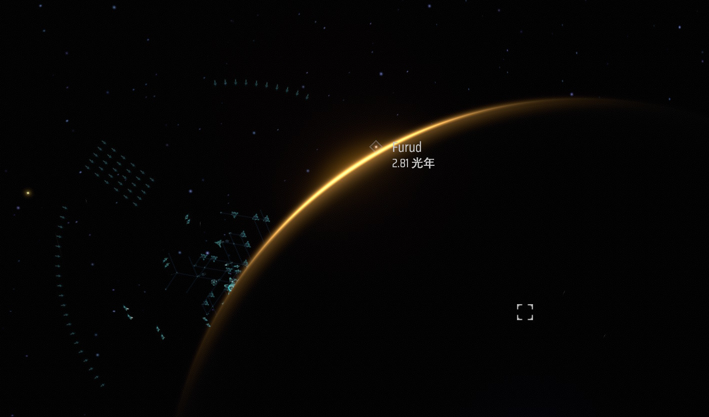

我已经忘了那是什么时候的事情了，总之，那是我第一次在宇宙里当太空垃圾来着。
那段时间我沉迷于某个建造戴森球的游戏，说是游戏，其实倒像是“工作”。一份没有薪水、没有下班时间、也没有同事的工作。我操纵一个叫伊卡洛斯的轻型工业机甲，降落在一颗又一颗星球上，把地表翻个底朝天。铜矿、铁矿、硅石、钛晶石，我把它们从地底下挖出来，送上传送带，传送带连着冶炼炉，冶炼炉连着组装机，组装机再连着下一条传送带……当一颗星球上铺满了密密麻麻的工业产线之后，就飞向下一颗。我的终极目标是在恒星外面造一个把它整个包裹住的戴森球，为此需要海量的材料，而每一颗星球都只是这条漫长生产链上的一个环节。
我很投入，投入到什么程度呢，伊卡洛斯在星球之间飞行的时候，我的眼睛只盯着左下角的星图，盘算下一颗星球的矿物和产线布局。星图以外那片漆黑和点点星光，对我来说只是加载画面而已。产线铺好，星球跑完，星图上的数字变大，就够了。为什么要做这些，谁在乎呢。

然后，在某一次星际航行中，我的燃料用完了。

伊卡洛斯停在了不知道哪里的虚空中。前不着村，后不着地。引擎安静了，组装机的嗡嗡声也不在了。什么都没有了。屏幕上只有深邃的黑暗，更远处几个暗淡的光点，和一个在缓慢自转的小小人形机器人。我翻了翻背包，没有燃料。看了看星图，附近的星球以现在的状态根本飞不到。我试了几种操作，全都无效。伊卡洛斯不会坠毁，也不会漂走，它只是停在那里，像被废弃的太空垃圾一样。

折腾了一会儿，我放弃了。我把两只手从键盘和鼠标上拿开，用手撑着头，看着屏幕。之前几个小时里一直在高速运转的脑子，我就这样停止了思考。
我就这样看着，我也不知道在看什么。屏幕上什么也没有发生，黑色的背景连一粒灰尘都没有。我不知道过了多久，也许两三分钟，也许更长一些？

然后，在漆黑的屏幕里，突然出现了一些绿色的小点，似乎还是呈现出某种阵型。我慢慢反应过来，这是游戏里的敌人，黑雾。只是此时这些敌人离我很远很远，不用担心，这阵型还挺好看的。嗯？等等，为什么黑雾是从屏幕中央出现的？我的脑子又缓慢的运转起来。噢，原来我面前的这深邃的黑暗，并非宇宙背景，而是因为我正处于某个巨大行星的阴影中。伊卡洛斯一直在它旁边，只是因为角度的关系，它之前正好藏在视野之外。随着伊卡洛斯缓慢的自转，这颗行星从边缘处一点一点地滑进了画面。
它太大了，不是“哦这颗行星挺大的”，而是一种突然意识到“我在一个很大的东西旁边而我之前完全不知道”的感觉，伊卡洛斯那个小小的人形在它面前就像是消融了一般。整个屏幕被它的弧面填满，暗色的地表纹理铺展开来。

正当我对这宇宙的巨物产生了些许恐惧时，一丝橙色的光芒从行星的边缘露出来了。

是这个星系的恒星。它藏在行星的背面，并没有直接露出来，但它的光沿着行星的边缘弯折过来，在那道巨大的弧线上镀出了一层光晕。弧线正中央是近乎金色的亮光，往两侧渐渐化成橘色和琥珀色，最后融进了行星暗面那片彻底的黑，整颗行星的轮廓就被这样的弧线勾勒了出来。弧线的旁边就是那些黑雾的阵型，青绿色的几何网格静静地浮在那里。

我看了一眼距离标注，1274米。那些我在星图上用一个圆点代替的东西，在一公里以外是这个样子的。
我不知道自己盯着这个画面看了多久。周围很安静，只有电脑风扇和若有若无的电流声。

前几天闲暇时，我偶然间重新翻开上远野浩平的《夜巡者》。

这部轻小说我很早就读过。年少时最初吸引我的是它每一卷的名字——《我们在虚空中巡视夜晚》《我们在虚梦中倾听月色》《我们与虚人在星上共舞》，透着一种孤寂的诗意。但它真正让我记住的，是第一卷的结局。这部作品的设定是这样的：人类乘坐着飞船流浪在宇宙中，绝大部分人类都在飞船内的梦境中生活着，只有极少部分人类会在飞船遇到敌人的时候，精神被强制抽离出梦境，然后驾驶巨大的机甲和异星敌人战斗。

这部作品是上远野浩平早期的作品，它出版于 2000 年，设定算不上新奇，但是它和前辈们相比，重点其实不太关乎战斗或者是高中生谈恋爱，而是为了制造压迫感。书里有一段对宇宙的描述，我感觉还挺特别的——

> 虚空的确是具有压迫的，而且人类的存在啦，一路累积而来的历史啦，继承前人的种种思想感情啦，在虚空面前只不过是微小的尘土而已。可是夜行者的核心，并无法从里面逃脱。如果有压力，自然有机械会帮忙分解。如果有孤独感，就藉着在潜意识中生活在别的世界里来补偿。绝望也是用还有可能性来打发过去。

压力有机械分解，孤独有虚假世界补偿，绝望用“还有可能性”打发，这就是书中流浪在宇宙中的人类的处境。主角工藤兵吾就是活在这样的世界中，在梦的世界中他是个普通得不能再普通的少年，也没什么目标，日子得过且过，也没有什么特别想做的事。被唤醒去战斗的时候他就去战斗，回到虚拟日常的时候他就继续当一个透明人。他不反抗，也不疑惑，甚至不太会主动去想“我为什么在这里”这种问题。战斗间隙他最常做的事是发呆，哼歌，想一些无关紧要的小事。对于驾驶舱外那片无边的虚空，他的态度不是“我要战胜恐惧”，而是干脆不去看，不去想。

但书里写到后面，兵吾开始隐隐约约地碰到了一个问题。他试着去理解敌人“虚空牙”在想什么，结果发现自己根本想不通。然后他意识到，想不通的其实不只是敌人，也包括自己。

> 没错，如果事前让不过是个平凡学生的工藤兵吾知道一切，问他要不要去人类头顶上的虚空战场，那么自己大概会因为恐惧而逃走吧。
> 或者是——为了逃避遭到同班同学忽视，受到棒球社学长们敌视，这种让人心烦意乱的现实，而憧憬于战斗主动投入？进而主动投身其中呢？

恐惧和渴望，逃避和前进，他分不清这两者之间有没有界限。他也没有试图去分清。他只是带着这个问题继续往前走了。

然后是第一卷最后的战斗。兵吾耗尽了机甲所有的能量。系统离线，方向丧失，没有燃料，没有通讯，没有归路。维持生命的能源也在一点一点耗尽。他不会得救，他自己很清楚，所谓战士只是保护这艘方舟的消耗品。但在彻底的黑暗和寂静中，兵吾反而感到了一种奇怪的平静。小说里这样写：

> 回过神来，正在低声哼着歌。
> 想不起这是什么歌。是存在于安定装置的人生记忆中的歌呢？还是残存于第一个成为核心的人类，固定记忆里的歌呢？自己不只一头雾水，而且也没想过要弄清楚。
> 反正，这歌也只有他听得到。

紧接着，他做了一个决定。下令打开机甲的外部装甲。在此之前，他从未用自己的眼睛直接看过外面的宇宙。所有的视觉信息都是通过传感器传递的，人的肉眼和精神被认为无法承受绝对真空的直视，但现在已经没有什么值得留恋的了。
他只是想亲眼看一看。伴随着细微的机械声，前方的装甲一块一块地退去了。
而他看到的，并不是他一直恐惧的“什么都没有的虚空”。

书中是这样写的——

> 彷佛配合着上盖开启的动作，他的双眼睁得越来越大。
> 他说不出话来。
> 那就在逐渐开展的世界的另一边。
> 因为至今为止有过的恐怖，有过的压力，所以从未认真地仔细看过的那个景象，就存在他的正前方，全面而直接了当的无边无际。
> 密密麻麻，满天繁星充满了他的视野，而那数不尽的无数星星，不论何者闪耀着的光芒都能使得所有宝石、艺术、悲欢离合——黯然失色，近乎消灭。
> 靠近银河中心的那片星空，远比从地球望出去的密度更高。这是恒星燃烧的辐射造成的，又或者是重力异常造成的歪曲现象，像是要把这些理论的认知彷佛全都燃烧怠尽似的，星球们巨大地、丰富地、压倒性地闪闪发光，只是一心地呈现着——美丽。
> 在无穷的星空底下，有个战士遗忘了一切，他就像是首次碰到新鲜事物的孩子，以湿润的双眼凝视着这片无边无际的海洋。
> 那是片被称为虚空却又不虚无，它就在那无尽繁星的——夜晚的另一端。

书的最后没有给兵吾答案。他关于人类和虚空牙到底有什么区别的疑惑，到最后也没有弄清楚。
书的最后一行是：***一切逝去了，以往的事物。此刻的我，只是听着繁星之歌。***

我再次读到这里的时候，脑子里浮现的画面不是书中描写的那片银河，而是那颗行星，是游戏里我的机甲耗尽燃料，漂浮在黑暗中什么都做不了的那几分钟。
行星的弧线切开了整个屏幕，阴影那一侧什么都看不见，然后光从边缘透过来，一点一点，橘色的，铺满了整个弧面。
我当时什么也没想，没有想怎么脱困，没有想要不要重开，甚至没有意识到自己在看。只是停在那里，在一个已经没有任何事情可做的时刻，终于把眼睛睁开了。
兵吾的结局书里没有写，后续的故事里换了主角，他再也没有出现过，也许他死了，也许没有，但我觉得结局并不重要。
重要的是，在这结果早已注定的时刻，他选择了睁开眼睛。

---

我后来重开了那局游戏，学会了随时检查燃料，再也没有让自己陷入过那样的境地。
即便是现在，我也还是每天忙着各种各样的事情，漫无目的的过着生活。只是偶尔，会在某个不经意的时刻停下来，抬头看看天空。
我想着，那几分钟里看到的那道光，大概也是属于我的，繁星之歌吧。
